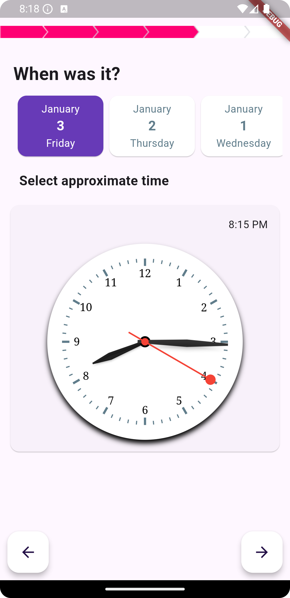

# analog_time_picker package for Flutter

[](https://pub.dartlang.org/packages/lanalog_time_picker)

A Flutter package for iOS and Android for picking last seven dates and time with analog view.
## Demo



## Installation

First, add `analog_time_picker` as a [dependency in your pubspec.yaml file]

### iOS

No configuration required - the plugin should work out of the box.

### Android

No configuration required - the plugin should work out of the box.

### Code for the analog day time picker

``` dart
import 'package:analog_time_picker/analog_time_picker.dart';


class AnalogDayPick extends StatelessWidget{
 Map<String, DateTime> _dateTime = {};
 
  @override
  Widget build(BuildContext context) {
    return AnalogTimePicker(
                           onChanged: (Map<String , DateTime value>){
                            _dateTime = value;
                           },
                         );
  }
}
```
